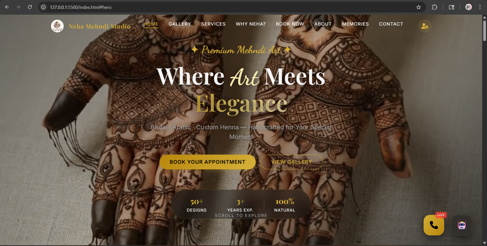

# ✨ Neha Mehndi Art - Premium Software Solution ✨

[](https://opensource.org/licenses/MIT)
[](#)
[](#)
<center>
<br/>
<a href="https://nehaart.vercel.app">
  
</a>
</center>
 **Elevating the Art of Henna through Modern Technology.** 
> A comprehensive platform for Neha Mehndi Art, featuring 3D design showcases, automated booking systems, and a cinematic user experience.

---
<center></center>
## 🌟 Key Features

- **🎨 Immersive UI/UX**: A dark-themed, glassmorphic design that reflects the premium nature of bridal art.
- **📅 Smart Booking System**: Integrated with Google Sheets (via Google Apps Script) for real-time inquiry management.
- **✨ 3D Design Portfolio**: Dedicated sections for interactive 3D Mehndi design previews and cinematic video backgrounds.
- **⚡ Performance Optimized**: Minimalistic load times with localized assets and CDN-backed libraries.
- **📱 Responsive & PWA Ready**: Optimized for all devices with specialized mobile-first metadata.
- **🔍 SEO Engine**: Comprehensive metadata strategy ensuring high ranking for bridal art services.

---

## 🛠️ Technology Stack

| Layer | Technology | Purpose |
| :--- | :--- | :--- |
| **Frontend** | Vanilla HTML5, CSS3, JavaScript (ES6+) | Core architecture and logic |
| **Styling** | Modern CSS (Flex/Grid, Glassmorphism) | Visual excellence and animations |
| **Backend** | Google Apps Script (GAS) | Serverless form handling and logic |
| **Icons** | FontAwesome 6.7.2 | Premium iconography |
| **Fonts** | Google Fonts (Playfair Display, Inter) | Sophisticated typography |

---

## 📂 Project Structure

```text
├── 3d/                 # 3D assets and special video content
├── images/             # High-resolution portfolio images
├── logo/               # Branding assets
├── index.html          # Main landing page
├── booking.html        # Interactive booking flow
├── contact.html        # Connectivity hub
├── about.html          # Artist profile
├── memories.html       # Cinematic gallery
├── main.js             # Core frontend orchestrator
├── style.css           # Premium design system
└── Code.gs             # Backend serverless logic
```

---

## 💎 Design Philosophy

This project follows a **Premium Dark Aesthetic** designed to "WOW" users at first glance. It utilizes:
- **HSL tailored color palettes** (Gold & Obsidian)
- **Glassmorphic components** with high-blur backdrops
- **Subtle micro-animations** for interactive feedback
- **Cinematic video backgrounds** for emotional engagement

---

## 👨‍💻 Developer

**Harshad Teli**
- 📧 [harshadteli@gmail.com](mailto:harshadteli@gmail.com)
- 🌐 [Harshad Teli Portfolio](https://harshadteli.github.io/harshadteliportfolio)

---

## 📜 License

Distributed under the MIT License. See `LICENSE` for more information.

---

<p align="center">
  Developed with  for <strong>Neha Mehndi Art Studio Collection</strong>
</p>
